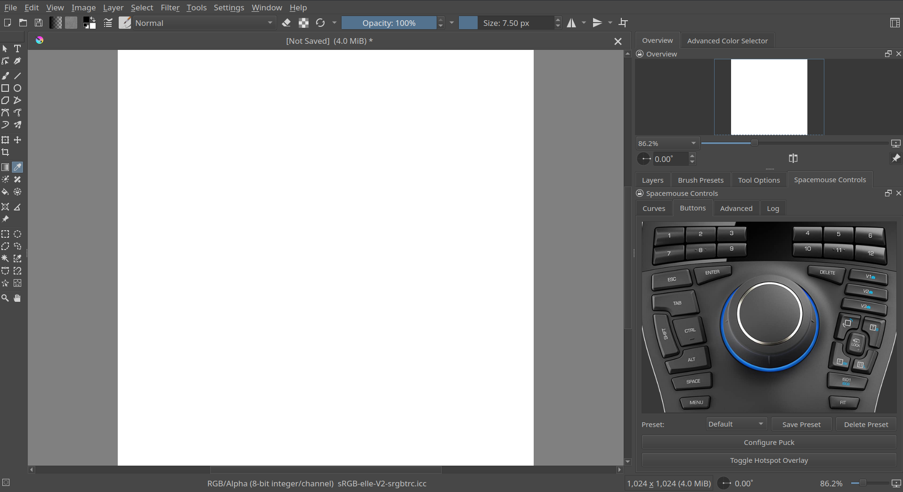
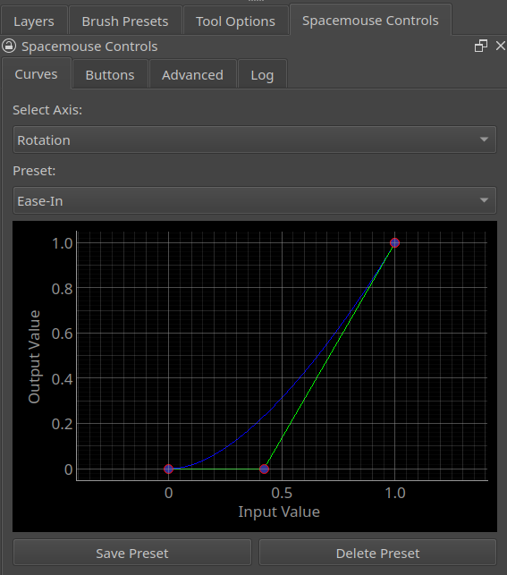
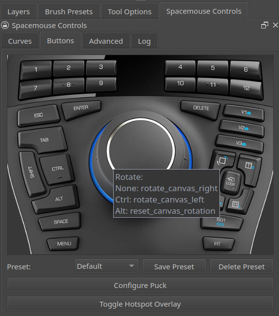
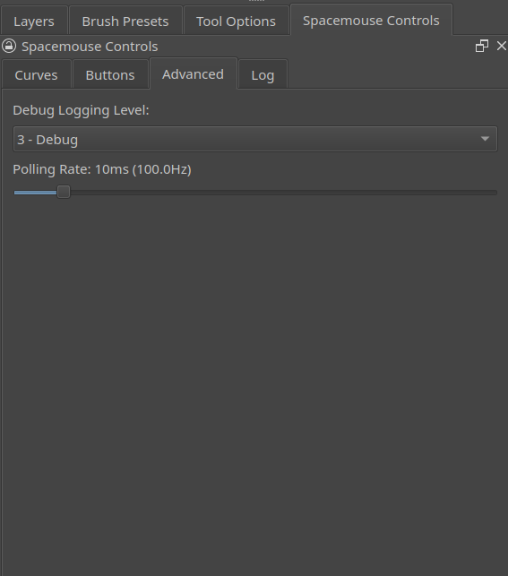
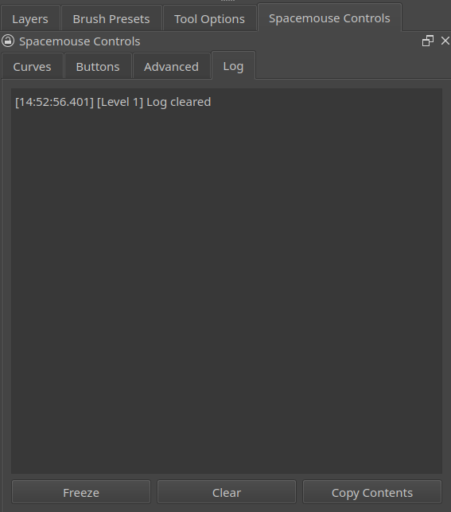

# Krita SpaceMouse Plugin

- A feature-rich plugin for integrating SpaceMouse functionality with Krita under Linux.

- Leveraging the SpaceMouse's powerful 6 axis joystick and compact array of buttons, Krita_SpaceMouse seeks to fully eliminate the need for a keyboard from the user's desktop, allowing you to focus on what really matters: Your Art.

- Aimed primarily at the SpaceMouse Enterprise and its generous array of 31 buttons, Krita_SpaceMouse allows binding of keys to an overwhelming number of Krita's internal actions. Other SpaceMouse models should benefit from this plugin, though at a reduced functionality due to the limited number of buttons.

## Features
- Allowing independent configuration of the SpaceMouse's 6 axes, each of Krita's canvas motion axes (X, Y, Zoom and Rotate) can be assigned exactly as you like, allowing for a smooth, dynamic, and intuitive experience custom tailored to your workflow. 

- Modifier keys expand the SpaceMouse Enterprise's 31 buttons into a nearly endless array of custom functionality.

- Configuration is achieved through a convenient re-scaleable docker that allows you to see your changes instantly on the canvas. No need to navigate through complex menus to make quick changes.

## Docker Overview
## Curves Tab

- Each of the canvas' 4 axes of motion can be independently tweaked to feel just as you would like. Allow quick jumps around the canvas while maintaining precise control near center stick, or opt for a linear response from center to edge. The choice is yours!

- Bundled with 5 predefined presets (Linear, Ease-In, Ease-Out, Ease-In-Out, and Steep), and providing saveable user definable profiles, the perfect feel for canvas navigation is always at your fingertips. Settings persist across sessions, allowing you to jump right back into your work after restarting Krita.

## Buttons Tab

- The Buttons Tab provides an interactive view of the SpaceMouse's control console. There is no need to need to look for obscure button names in a long list, simply click on the Puck (the SpaceMouse's center motion joystick) or the button you wish to bind, and the appropriate configuration utility pops up.

- Forget which actions you've bound to a specific button? No problem! Simply hover over the button in question and a tooltip pops up to show you the actions mapped to that button, including its modifier key bindings.

- Saveable profiles allow you to create, save, and change button mappings on the fly to target your current workflow.

## Advanced Tab

- User-definable polling rate allows you to strike your own balance between performance and resource usage. A lower polling rate increases the precision of input at the cost of system resource consumption.

- Variable logging feedback allows for targeted troubleshooting by controlling the verbosity of the Log Tab.

## Log Tab

- Useful for debugging troublesome behavior, the Log Tab gives you insight into the health of the plugin. Freeze the output for easy reading, copy the log contents to assist others in helping you troubleshoot, or clear the contents to start anew.

## Additional Features

- Quick-View button feature (Buttons V1-V3 by default) allows for quickly storing and retrieving up to 3 canvas views. Save your current view (including canvas Location, Rotation and Zoom level) and return at the touch of a button. Jump between your current point of focus and your reference image, or bounce between details and full face or character views instantly.

- Mappable modifier keys: Even your valuable modifier keys can be remapped exactly as you'd like. Don't like the feel of the Shift button? Move its functionality exactly where it feels natural to you.

## Dependencies

## Installation (Currently Linux-only)

**Zip**: Unpack to `~/.local/share/krita/pykrita/`.

**Git**: `cd ~/.local/share/krita/pykrita/ && git clone https://github.com/Totem-FPV/Krita_SpaceMouse.git`.

**Enable**: In Krita, go to `Settings > Configure Krita > Python Plugin Manager`, enable "SpaceMouse Plugin", restart Krita.
**Add Docker**: `Settings > Dockers > SpaceMouse Controls`.

**Note**: Buttons in spnav, including modifier keys, must pass through as normal buttons. Setting Shift key to Shift in spnav will remove all functionality from that key in Krita.

## Known Bugs

- Buttons Tab scales poorly on load—resize the docker to fix.

## Feedback

- Report issues at [GitHub Issues](https://github.com/Totem-FPV/Krita_Spacemouse/issues)!

